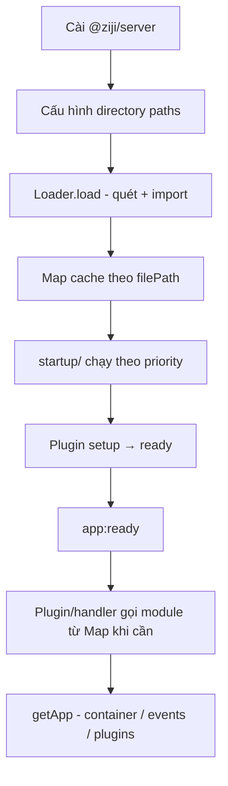

## 1. Dự án này là gì, trong một câu

`@ziji` là một backend framework Node.js/TypeScript theo convention-over-configuration, với core cực nhỏ (lifecycle + DI + event
bus) và mọi tính năng khác (HTTP, WS, DB, cache...) là plugin chính thức — không phải code lõi.

## 2. Flow hoạt động của toàn dự án

Đây là luồng chuẩn từ lúc người dùng cài package đến lúc code runtime chạy. Mọi task AI làm phải hiểu và tuân theo flow này — không
đảo thứ tự, không bỏ qua bước.

```
cài package → trỏ thư mục load → cache module vào Map → startup chạy theo priority → gọi module khi cần → module truy cập app singleton
```

### 2.1. Người dùng cài package

Người dùng cài meta-package `@ziji/server` (hoặc `@ziji/core` + từng `@ziji/plugin-*` nếu muốn tối ưu bundle). Entry point thường
là `Server` hoặc `ZijiApp` — không khởi tạo HTTP/DB trực tiếp trong app code.

### 2.2. Trỏ đường dẫn thư mục để load

Framework nhận một hoặc nhiều `directory` cần quét, ví dụ:

- `startup/` — bootstrap theo thứ tự ưu tiên
- `routes/` — handler HTTP (plugin-router)
- `plugins/` — plugin/extension tự viết của app

Core cung cấp `Loader` (`packages/core/src/loader.ts`): quét đệ quy thư mục, import động theo extension (`.ts`, `.js`, `.mjs`,
`.cjs`), hỗ trợ cache và watch ở dev mode.

```ts
const loader = new Loader({ directory: "./startup", dev: true });
const loaded = await loader.load();
```

### 2.3. File đã load được lưu trong Map

Mỗi module import thành công được cache trong `Map<filePath, ModuleCacheEntry>` bên trong `Loader`. Public API:

| API | Mục đích |
| --- | --- |
| `loader.load()` | Quét + import, trả về `LoadedModule[]` |
| `loader.getModule(filePath)` | Lấy lại module đã cache theo đường dẫn |
| `loader.clearCache(filePath?)` | Xóa cache (toàn bộ hoặc một file) |

Plugin/handler **không import lại** file đã load — lấy từ Map hoặc từ kết quả `load()`.

### 2.4. Thư mục `startup/` chạy theo thứ tự ưu tiên

Sau khi load, các file trong `startup/` được **thực thi theo priority** (số càng nhỏ chạy càng sớm). Convention:

- **Prefix số trên tên file**: `001-config.ts`, `010-database.ts`, `100-routes.ts`
- **Hoặc export `priority`**: `export const priority = 10`

Startup dùng để: load config, đăng ký plugin, kết nối DB, mount router — mọi thứ cần chạy **trước** khi app vào trạng thái
`ready`. Thứ tự startup độc lập với dependency graph của plugin manager; startup là bootstrap của app, plugin manager là lifecycle
nội bộ framework.

### 2.5. Gọi file đã load khi cần

Sau startup, framework và plugin lấy module từ Map khi cần dùng — không quét/import lại. Ví dụ thực tế:

- `plugin-router` dùng `Loader` quét `routes/`, đọc export có `__route`, register vào router
- Plugin `setup()`/`ready()` resolve service từ DI container thay vì import trực tiếp file startup

Lifecycle tổng thể: `app:boot` → config → **startup scripts** → plugin `setup` → plugin `ready` → `app:ready`.

### 2.6. File đã load truy cập app singleton

Module trong `startup/`, `routes/`, hoặc plugin có thể gọi **app singleton** để truy cập global state — không cần truyền `app`
qua từng constructor:

```ts
import { getApp } from "@ziji/core";

export default async function setup() {
  const app = getApp();
  app.container.register(MY_SERVICE, { useClass: MyService });
  app.events.emit("my:init", { ok: true });
}
```

Singleton trỏ tới instance `ZijiApp` duy nhất: `container` (DI), `events` (event bus), `plugins` (plugin manager). **Chỉ dùng sau
khi app được khởi tạo** — gọi trước boot sẽ throw.

### 2.7. Sơ đồ tóm tắt



## 3. Việc AI KHÔNG được làm, dù task nào yêu cầu

- **Không thêm logic HTTP/DB/WS vào `packages/core`.** Core không được import bất cứ thứ gì từ `plugin-*`. Nếu một task có vẻ cần
  điều này, đó là dấu hiệu task nên được chia lại, không phải lý do để phá nguyên tắc.
- **Không tự viết ORM hoặc query builder mới.** Mọi thứ liên quan DB phải là adapter quanh Prisma/Drizzle có sẵn, không viết logic
  truy vấn từ đầu.
- **Không đổi shape của Event Bus / DI Container / Plugin lifecycle** (`setup→ready→reload→dispose`) mà không có RFC markdown
  trong `docs/rfcs/` được duyệt trước. Đây là API đông cứng — đổi ở đây vỡ mọi plugin downstream.
- **Không dùng `any` để né lỗi type ở public API.** Nội bộ implementation có thể tạm `any` với `// TODO: type this`, nhưng type
  xuất ra cho người dùng framework phải chính xác.
- **Không thêm dependency runtime mới vào `@ziji/core`** mà không hỏi trước — core phải nhẹ nhất có thể vì nó luôn bị import.

## 4. Cách tiếp cận một task mới

Trước khi viết code, tự trả lời 3 câu hỏi:

1. **Task này thuộc package nào?** Nếu không chắc, dừng lại và hỏi — đừng đoán đại rồi đặt code sai chỗ.
2. **Task này có phá vỡ API đông cứng ở mục 3 không?** Nếu có, cần RFC trước, không code trước.
3. **Có adapter/lib có sẵn làm được việc này chưa?** Ưu tiên adapter hóa thứ có sẵn hơn viết mới từ đầu, trừ khi đó chính là core
   logic của `@ziji`.

## 5. Bản đồ package → trách nhiệm (đọc trước khi sửa file)

| Package           | Được phép chứa                                             | Tuyệt đối không chứa                                          |
| ----------------- | ---------------------------------------------------------- | ------------------------------------------------------------- |
| `core`            | lifecycle, DI container, event bus, plugin manager, loader | HTTP, DB, WS, bất kỳ adapter nào                              |
| `server`          | re-export tiện lợi, không có logic riêng                   | logic thật (nếu có logic thật, nó thuộc package khác)         |
| `plugin-http`     | adapter Fastify/Express                                    | business logic của app người dùng                             |
| `plugin-router`   | file-based + decorator routing                             | validation logic phức tạp (nên gọi ra schema lib)             |
| `plugin-database` | adapter Prisma/Drizzle                                     | ORM tự viết                                                   |
| `cli`             | scaffold, dev/build/start command                          | logic runtime của server                                      |
| `testing`         | mock app/context, test helper                              | code chỉ dùng nội bộ core (import ngược từ core là sai hướng) |

## 6. Core hiện tại có thể làm gì

`@ziji/core` hiện cung cấp:

- Lifecycle application sequence: `boot()`, `ready`, `shutdown()`
- Typed DI container with token-based registrations, singleton/transient resolution
- Typed event bus with `on`, `once`, `emit`, listener priority, and wildcard support
- Plugin manager with dependency graph resolution and circular dependency detection
- `Loader` — quét thư mục, import động, cache module trong Map, watch ở dev mode

## 7. Định nghĩa "xong" (Definition of Done) cho mọi PR do AI tạo

Một task chưa xong nếu thiếu bất kỳ điều nào:

- [ ] Có unit test cho logic mới (core yêu cầu > 90% coverage, plugin khác > 70%)
- [ ] Type public API đầy đủ, không `any` lộ ra ngoài
- [ ] Nếu thêm plugin/extension mới → có ví dụ chạy được trong `examples/`
- [ ] Nếu đổi hành vi có thể breaking → đã thêm changeset (`pnpm changeset`) mô tả rõ breaking change
- [ ] Error message khi fail phải nói rõ **plugin nào, field nào, vì sao** — không throw message mơ hồ như "Invalid config"
- [ ] Chạy `pnpm lint && pnpm typecheck && pnpm test` sạch trước khi coi là hoàn thành

## 8. Thứ tự ưu tiên khi có xung đột giữa các mục tiêu

Khi một quyết định kỹ thuật buộc phải đánh đổi, xếp theo thứ tự này:

1. **Đúng với triết lý core-nhỏ / plugin-hóa** (mục 1–2) — không đánh đổi mục này.
2. **An toàn & type-safe** — không hy sinh type-safety để code ngắn hơn.
3. **DX (developer experience)** — error message rõ, API dễ đoán.
4. **Performance** — quan trọng nhưng không được đánh đổi 3 mục trên, trừ khi có benchmark chứng minh chênh lệch nghiêm trọng.
5. **Ít code nhất** — chỉ xếp cuối, vì "ngắn" không phải mục tiêu của framework này.

## 9. Khi AI không chắc

Nếu một yêu cầu (từ người dùng framework hoặc từ task) mâu thuẫn với các nguyên tắc trên, AI nên:

- Nêu rõ mâu thuẫn đó là gì,
- Đề xuất cách làm đúng nguyên tắc,
- Không tự động "linh hoạt" bỏ nguyên tắc để hoàn thành task nhanh hơn.

## 10. Liên kết tài liệu liên quan

- Kiến trúc & todo tổng thể: `todo.md`
- RFC các quyết định API đông cứng: `docs/rfcs/`
- Convention code (lint/format): `.eslintrc`, `.prettierrc` ở root repo

---

_Cập nhật file này ngay khi có quyết định kiến trúc mới — đây là nguồn AI đọc đầu tiên, để nó cũ là để AI làm sai hướng._
